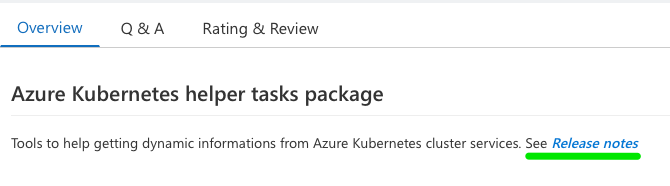

## Related Issues

- ### [Issue0016](https://github.com/expertasolutions/AKSToolsSet/issues/16)

  - **KubectlGetServiceIP**
    - Task source code update to Typescript
    - Update npm @azure dependencies

  - **KubectlGetServiceSelector**
    - Task source code update to Typescript
    - Update npm @azure dependencies

- ### [Issue0016](https://github.com/expertasolutions/AKSToolsSet/issues/23)

  - Add the Release notes support for GitHub release to the VisualStudio Marketplace page

    