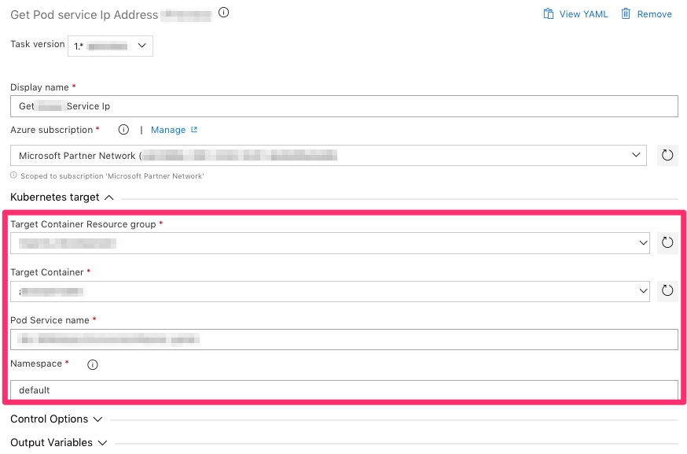
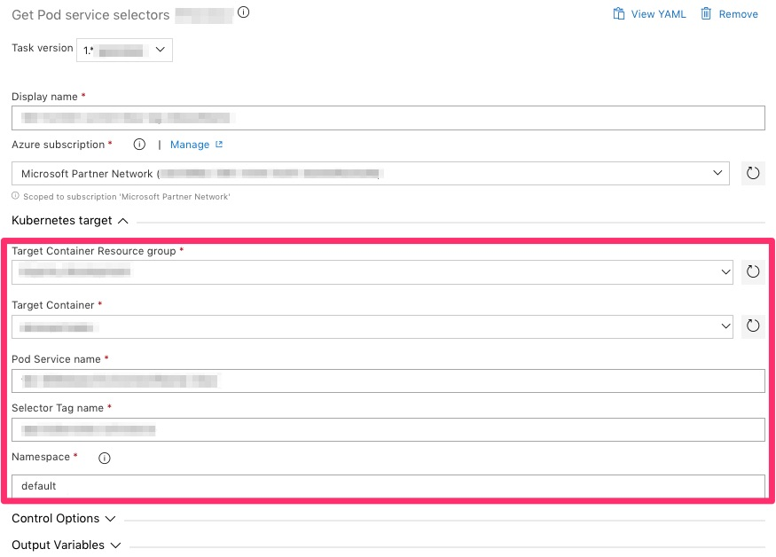

# Azure Kubernetes helper tasks package
Set of tasks to help getting dynamic informations from POD's from Azure Kubernetes Services cluster. See ***[Release notes](https://github.com/expertasolutions/AKSToolsSet/releases)***

## Available tasks

### KubectlGetServiceIp

#### Task output variables
- $referenceName.podServiceIp

### KubernetesGetServiceSelector

#### Task output variables
- $referenceName.selectorValue
- $referenceName.serviceExists (true|false)

## Supported build agents
- Hosted macOS build agent (supported)
- Hosted VS2017 (supported)
